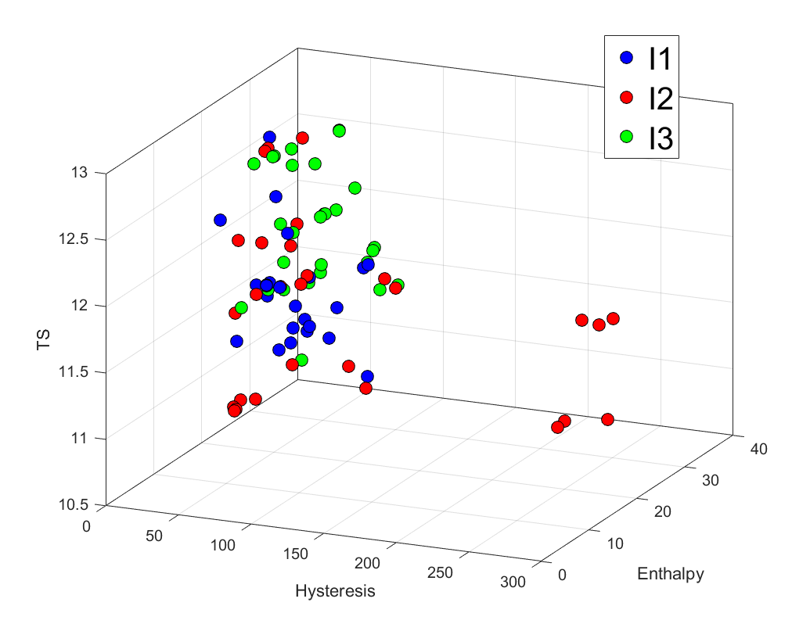

# NiTi Alloy Discovery

Research code and data for the data-driven discovery of nickel-titanium-based shape-memory alloys. The repository contains two successive experimental-design snapshots that use Gaussian-process surrogate models and batch Bayesian optimization to propose alloy compositions.



*Archived objective-space view. `I1`, `I2`, and `I3` denote experimental rounds 1–3; measurement units are not documented consistently in this repository snapshot.*

## Optimization problem

Every composition is represented by seven columns in this fixed order:

`Ni, Ti, Cu, Hf, Zr, Pd, Co`

The workflow considers three objectives and one stated feasibility target:

| Quantity | Goal |
| --- | --- |
| Hysteresis | Minimize |
| Enthalpy | Maximize |
| Transformation strain | Maximize |
| Martensite-start temperature (`Ms`) | Greater than 200 °C |

The optimization scripts do not predict `Ms` directly. The target is encoded through the prepared feasible-candidate files, hard-coded constraint-violator indices, and—in Iteration 2—candidate feasibility weights.

For each sampled set of Gaussian-process length scales, the code:

1. Fits one squared-exponential Gaussian process per objective to the difference between experimental measurements and prior-model predictions.
2. Adds the prior predictions back to obtain posterior predictions over the candidate space.
3. Computes expected hypervolume improvement (EHVI) relative to the measured Pareto front.
4. Applies candidate feasibility weights. Iteration 2 uses probability-weighted extra candidates; Iteration 3 currently searches only the pre-screened feasible set with unit weights.
5. Retains the best candidate, then uses k-medoids to reduce 1,000 retained candidates to a batch of 29 proposed compositions.

The main constants—including `N_GP`, `Batch_size`, objective directions, normalization factors, incomplete measurements, and constraint violators—are defined near the top of each iteration's `main.py`.

## Repository layout

| Path | Contents |
| --- | --- |
| `Iter2/` | Second design snapshot: 29 tested alloys, 6,658 pre-screened feasible candidates, probability-weighted extra candidates, code, inputs, and saved outputs. |
| `Iter3/` | Latest design snapshot: 58 tested alloys, 13,518 pre-screened feasible candidates, code, inputs, figures, and saved outputs. |
| `Iter*/main.py` | End-to-end batch Bayesian-optimization workflow for that snapshot. |
| `Iter*/gpModel.py` | Gaussian-process wrapper built on `george`. |
| `Iter*/multiobjective.py` | Pareto-front, hypervolume, and EHVI calculations. |
| `Iter*/reificationFusion.py` | Utilities for fusing predictions from multiple models. |
| `Iter*/Probability_calculations/` | Separate, large-scale feasibility-scoring workflow. |
| `Iter*/postprocessing_analysis.m` | Historical MATLAB workspace analysis; it is stale and is not expected to run unchanged. |
| `Iter3/Summary.pptx` and image/figure files | Archived plots and presentation material from the study. |

The iteration directories are self-contained historical snapshots. They are not stages of an automated pipeline, so use the code and data from the same directory together.

## Setup

### 1. Clone the full data

The full design-space CSV is stored with Git LFS. Install Git LFS before cloning, or pull the LFS objects in an existing clone:

```bash
git lfs install
git clone https://github.com/sinazadeh/NiTi-alloy-discovery.git
cd NiTi-alloy-discovery
git lfs pull
```

The primary optimization scripts use the smaller feasible-space files, but the feasibility-probability workflow requires `all_space.csv` (about 122 MB and 3.8 million rows).

### 2. Create a Python environment

The original cluster scripts reference Python 3.8.2, and dependency versions were not recorded. A dedicated environment is therefore recommended.

```bash
python -m venv .venv
```

Activate it with one of the following commands:

```powershell
# Windows PowerShell
.\.venv\Scripts\Activate.ps1
```

```bash
# macOS or Linux
source .venv/bin/activate
```

Install the packages imported by the workflow:

```bash
python -m pip install numpy pandas scipy scikit-learn scikit-learn-extra george pyDOE joblib matplotlib
```

There is currently no requirements or lock file with pinned versions, so resolving mutually compatible package versions may be necessary on newer Python releases. MATLAB is optional and is needed only for the archived `.m`, `.mat`, and `.fig` material.

## Run the latest optimization snapshot

The scripts load files relative to the current working directory. From the repository root, run the latest snapshot inside its iteration directory:

```bash
cd Iter3
python main.py
```

To run the earlier snapshot, use `Iter2` instead. There are no command-line options; edit the constants near the top of `main.py` to change the number of Gaussian-process samples, batch size, or optimization settings.

> **Before running:** the default calculation fits 1,000 sets of three Gaussian processes, evaluates the full candidate set, and uses all logical CPUs reported by `multiprocessing` through `joblib`. It can be computationally expensive. It also overwrites version-controlled result CSVs in the iteration directory, so run from a copy if the archived outputs need to be preserved.

### Main outputs

The code writes these generated CSVs without headers; a few archived result files may contain labels added during later analysis.

| File | Shape with default settings | Meaning |
| --- | ---: | --- |
| `current_GP.csv` | 1 × 1 | Zero-based index of the most recently started GP sample; useful as a progress marker. |
| `all_candidates.csv` | 1,000 × 7 | Best composition selected for each length-scale sample. |
| `all_candidates_indices.csv` | 1,000 × 1 | Corresponding indices in the filtered candidate search space. |
| `all_improvements.csv` | 1,000 × 1 | Corresponding feasibility-weighted EHVI values. |
| `x_query.csv` | 29 × 7 | Final k-medoids batch of proposed compositions. |
| `x_query_indices.csv` | 29 × 1 | Medoid indices in `all_candidates.csv`. |

## Data conventions

Most model input and output files are headerless, and row alignment is assumed rather than checked in code.

| File pattern | Meaning |
| --- | --- |
| `feasibles.csv` | Candidate compositions treated as feasible by the workflow. |
| `tested_alloys.csv` | Experimentally tested compositions. |
| `o1_GT_y.csv`, `o2_GT_y.csv`, `o3_GT_y.csv` | Measured hysteresis, enthalpy, and transformation strain, respectively. |
| `hys_tested.csv`, `ent_tested.csv`, `TS_tested.csv` | Prior-model predictions at the tested compositions. |
| `hys_prior.csv`, `ent_prior.csv`, `TS_prior.csv` | Prior-model predictions aligned, in identical row order, with the unfiltered candidate pool; tested rows are removed before evaluation. |
| `lhp.csv` | 1,000 sampled sets of seven GP length scales. |
| `infeasibles.csv`, `probs.csv` | Extra candidates and their feasibility weights, used by Iteration 2. |

Composition inputs such as `feasibles.csv` and `tested_alloys.csv` are stored on a 0–100 scale and divided by 100 when loaded. Iteration 2's `infeasibles.csv` is already stored as fractions and is not divided again. Generated candidate files such as `x_query.csv` are written as fractions on a 0–1 scale. The repository does not state whether the original composition basis is atomic or weight percent; confirm that provenance before reusing the data.

The objective values are divided internally by normalization factors of 4 (hysteresis), 2 (enthalpy), and 1 (transformation strain). Saved candidate compositions are not converted back to the 0–100 input scale.

## Optional feasibility-probability workflow

Each iteration includes a separate script that scores the full 3,812,408-row composition space with a Gaussian process, filters additional candidates, and writes feasibility weights. From the repository root:

```bash
cd Iter3/Probability_calculations/itr3
python main.py
```

This script is sized for a high-memory, long-running computation and hard-codes the full design-space row count. It writes `current_loop.csv`, `p.csv`, `infeasibles.csv`, and `probs.csv` in its own directory. The supplied `runpython.sh` files contain site-specific Slurm settings, account details, module commands, and absolute environment paths; edit them for your cluster before use.

There is no automatic handoff from the nested probability directory to either parent iteration. To use the generated `infeasibles.csv` and `probs.csv`, copy them to the parent iteration directory or change the paths in its `main.py`. Iteration 2 will then load them directly. For Iteration 3, also enable the commented load-and-concatenate block and disable the following feasible-only assignments to `all_probs` and `all_space`.

## Reproducibility notes

- Saved outputs are included so the recorded results can be inspected without rerunning the expensive workflows.
- The code has no automated test suite, package metadata, or pinned dependency set.
- Missing-objective row indices and constraint-violating rows are hard-coded separately in each `main.py`; keep them synchronized with any replacement data.
- Helper modules execute within the iteration scripts' expected directory layout and are not presented as a stable library API.
- The MATLAB postprocessing files rely on preloaded workspace variables and contain historical batch-size assumptions, including a 16-versus-29 mismatch in Iteration 3.


## License

This project is licensed under the [MIT License](LICENSE).
